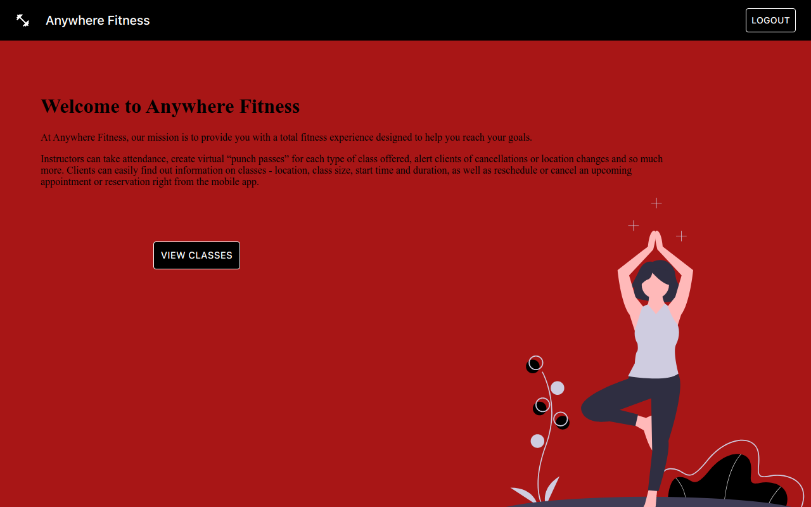

# Anywhere Fitness

https://fitness-anytime-frontend-eight.vercel.app/

Default instructor:

- email: lambda@gmail.com
- password: school

Default user:

- email: apple@gmail.com
- password: 123456

## Table of contents

- [Overview](#overview)
  - [The App](#the-app)
  - [Screenshot](#screenshot)
  - [Links](#links)
- [The process](#the-process)
  - [Built with](#built-with)
  - [Continued development](#continued-development)
  - [Useful resources](#useful-resources)
- [Authors](#authors)
- [Acknowledgments](#acknowledgments)

## Overview

These days, fitness classes can be held anywhere- a park, an unfinished basement or a garage- not just at a traditional gym. Certified fitness instructors need an easy way to take the awkwardness out of attendance taking, and user tracking for their classes.

While you could use several mobile apps to accomplish this, **AnywhereFitness** is the all-in-one solution to meet your “on-location” fitness class needs. AnywhereFitness makes it painless for Instructors and Clients alike to hold and attend Fitness classes wherever they might be held.

### The App

- Instructors can take attendance, create virtual “punch passes” for each type of class offered, alert clients of cancellations or location changes and so much more.

- Clients can easily find out information on classes - location, class size, start time and duration, as well as reschedule or cancel an upcoming appointment or reservation right from the mobile app.

### Screenshot

### Links

- Assignment: https://www.notion.so/Anywhere-Fitness-fc0ac268df284aaf8db3ae1913fa3134
- Flow Chart: https://www.figma.com/file/CSRiehufvZeC8xhpbBVMxj/Untitled?node-id=0%3A1
- Live Site URL: https://fitness-anytime-frontend-eight.vercel.app/

- Date & Time Picker: https://mui.com/components/date-time-picker/#static-mode
- Login Endpoint: https://fitness-anytime-backend.herokuapp.com/api/login

## The process

- Built flow chart with Figma to visualize components needed
- Created file structure to compartmentalize tasks
- Assigned tasks to team members depending on strengths
- Held daily meetings to pair program and regroup
- Created basic functionality, then added style and launched
- Connected front end to back end

### Built with

- Semantic HTML5 markup
- Flexbox
- Mobile-first workflow
- [date-fns](https://date-fns.org/) - date format and date utils library.
- [React](https://reactjs.org/) - JS library
- [Mui](https://mui.com/) - React component library
- [Styled Components](https://styled-components.com/) - For styled components

### Continued development

- Link payment app
- Allow instructors to refund payments
- Allow both instructors and clients to provide feedback

### Useful resources

- [Figma](https://www.figma.com) - This is where we began our design, creating a flow chart to visualize every component we would need.
- VSCode live share (VSC extension) - This extension allowed our team to code together and see each other's changes in real time. Very useful!
- [Zoom](https://www.zoom.com) - Useful for daily meetings, screensharing, and team building.
- [MUI](https://www.mui.com) - Great for pre-made styling, React component library.
- [Undraw](https://undraw.co/) - "Open-source illustrations for any idea you can imagine and create"

## Authors

- Darla Young (https://github.com/Darla-Young) - Unit 2 - Styling
- Albert Brannan (https://github.com/abrannan4) - Unit 2 - Forms
- Aaron Reyes (https://github.com/aaronpear) - Unit 2 - Forms & Search Bar
- David Spear (https://github.com/spearoxi) - Unit 3
- Brandon May (https://github.com/battleb2014) - Unit 4 - Backend
- Erik Bahena (https://github.com/ErikBahena) - Unit 3 - Overall Functionality/API integration

## Acknowledgments
